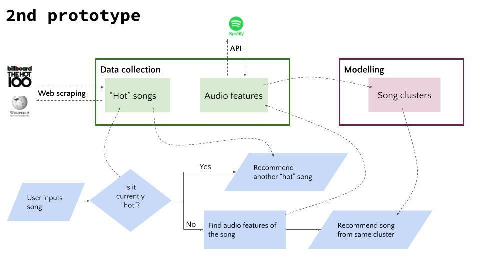

### Colaborators: 
* Andrea Tognolia https://github.com/Tognolia
* Federico Giuliani https://github.com/FedericoGi
* Antonio Saleme https://github.com/antonio-datahack
              
### Index 
* [GNOD Demonstrator](https://github.com/Tognolia/GNOD-music-demonstrators/blob/main/gnod%20demonstrator/GNOD%20demonstrators.ipynb)
* [MVP Prototipe](https://github.com/Tognolia/GNOD-music-demonstrators/blob/main/lab%20%7C%20web%20scraping%20%26%20MVP/Lab%20%7C%20MVP_prototype.ipynb)
* [Web Scraping | Single page](https://github.com/Tognolia/GNOD-music-demonstrators/blob/main/lab%20%7C%20web%20scraping%20%26%20MVP/Lab%20%7C%20web%20scraping%20single%20page.ipynb)
* [Web Scraping | FBI list](https://github.com/Tognolia/GNOD-music-demonstrators/blob/main/lab%20%7C%20web%20scraping%20%26%20MVP/Lab%20%7C%20FBI%20list.ipynb)
* [Web Scraping | Top 10 languages](https://github.com/Tognolia/GNOD-music-demonstrators/blob/main/lab%20%7C%20web%20scraping%20%26%20MVP/Lab%20%7C%20web%20scraping%20-%20%20top%2010%20languages.ipynb)
* [Web Scraping | The 20 latest earthquakes](https://github.com/Tognolia/GNOD-music-demonstrators/blob/main/lab%20%7C%20web%20scraping%20%26%20MVP/Lab%20%7C%20web%20scraping%20%7C%20the%2020%20latest%20earthquakes%20info.ipynb)

## Project outline

the project was part of the Iron Hack bootcamp 2021. We wanted to create a songe reccomender to help users discover new songs similar to the one they already liked and enhance theyr music portfolio. Web scraping and unsupervised learning techniques were applied as well as data wrangling and cleaning. 

## Project process

The project was developed using a project management process. Four modules compose the current result:

* ### Web scraping
First we scrapend the Billboards top 100 song website using CSS language and Beautiful soup library. https://www.billboard.com/charts/hot-100
* ### Scrape audio features from Spotify - API
We wanted to scrape the audio features from spotify in order to later cluster them. To do so we used Spotipy API. Thank to Spotipy we were able to download the top 50 song of a group of artist that we like. The total number of songs is about 2000. 
* ### Clustering
Using KMeans technique we were able to cluster the audio features. A number of eight features were created and various test to check the most appropriate grouping were executed.
* ### MVP
As last step we created a functional prototype, MVP. This function would ask for and input and check if it belongs to the top 100 list or not. In the first case it would reccomend the user another song for the same list. On the other hand the code will get teh audiofeatures of the input song, check to which cluster it belongs and eventually suggest a song from the same cluster. 

## Next step

We will work on:
- Create a larger dataframe of songs
- More roboust function
- Better user interface

# GNOD-music-demonstrators
